# STM32F103RB 다중 인터페이스 환경 센서 모니터

**I2C(BH1750 조도) · SPI(BMP280 기압·온도) · GPIO 비트뱅잉(TM1637 7-Segment) · UART 로그를 한 MCU에서 통합한 베어메탈 펌웨어**

<table>
<tr>
<td width="50%">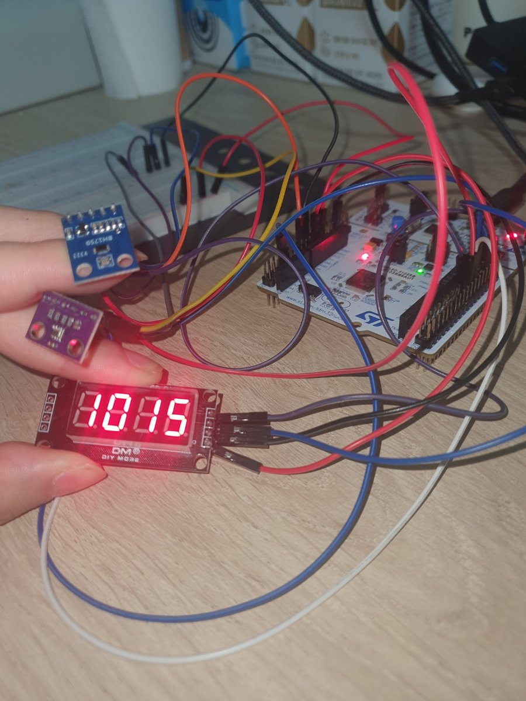</td>
<td width="50%">
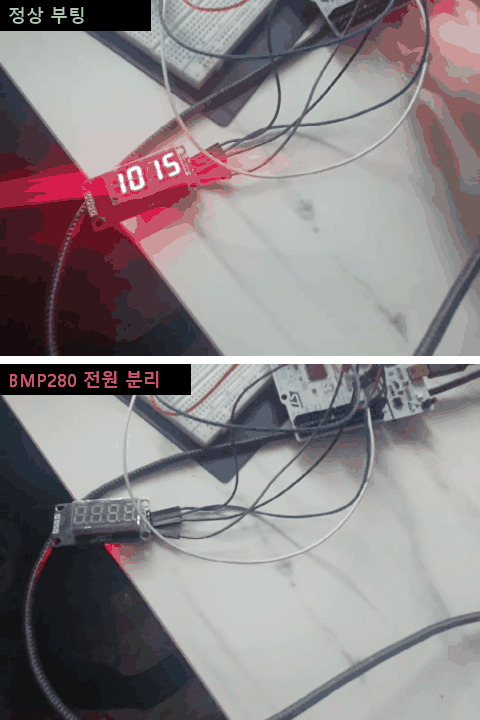 
부팅 자가진단 — 위: 정상 RESET → <code>TEST</code> → <code>GOOD</code> → 기압 <code>1015</code> hPa 
아래: BMP280 전원을 뺀 채 RESET → <code>TEST</code> → <code>ERR</code> (두 영상을 <code>TEST</code> 시점에 맞춰 합침)
</td>
</tr>
</table>

| 요구사항 검증 | 고장 주입 시험 | 실제 디버깅 사례 | Flash / RAM |
|:---:|:---:|:---:|:---:|
| **8 / 8 통과** | **3건** 일부러 선을 빼고 전원을 끊어 오류 감지 확인 | **2건** | **30 % / 13 %** |

---

## 하드웨어

<table>
<tr>
<td width="45%"> 전체 배선 (NUCLEO-F103RB + 브레드보드)</td>
<td width="55%"> 연결 회로도 — 센서 3.3 V, TM1637 5 V</td>
</tr>
</table>

| TM1637 4-digit (GPIO PB8/PB9) | GY-302 BH1750 (I2C1 PB6/PB7) | GY-BMP280 (SPI1 PA4~PA7) |
|:---:|:---:|:---:|
|  |  |  |

→ 핀 연결표, 3.3 V MCU와 5 V 표시기를 안전하게 연결한 방법, 풀업 저항 실측 (용어 풀이 포함): [02_hardware.md](docs/02_hardware.md)

## 시스템 구조

BMP280 센싱·표시 100 ms · BH1750 200 ms · UART 500 ms — `HAL_GetTick()` 기반 non-blocking 스케줄링

→ 개발 목적, 기능, 개발 환경, 부팅·런타임 흐름: [01_system_architecture.md](docs/01_system_architecture.md)

## 동작 데모

### ① 대기압 — 센서에 바람 불기 (BMP280 → 7-Segment)

 
센서에 바람을 불면 7-Segment 기압 표시가 <code>1015 → 1017 → 1015</code> hPa로 바뀜

### ② 조도 — 가리기 / 플래시 비추기 (BH1750 → UART)

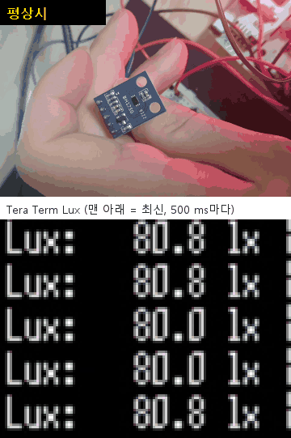 
위: 실제 동작 · 아래: 같은 시점의 Tera Term Lux 값 (두 녹화를 가림·손 뗌·플래시 순간에 맞춰 합침) 
평상시 약 80 lx → 손으로 가림 <code>0.0</code> lx → 플래시 비춤 최대 <code>6458</code> lx 
값은 동작보다 최대 약 0.7 s 늦게 찍힘: BH1750 측정 200 ms + UART 출력 500 ms 주기

### ③ 고도 — 보드 들어 올렸다 내리기 (BMP280 → UART)

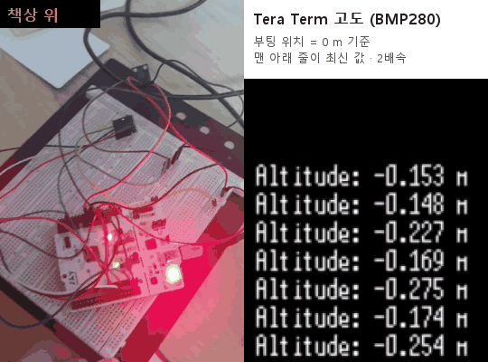 
왼쪽: 실제 동작 · 오른쪽: 같은 시점의 Tera Term 고도 (두 녹화를 들어 올림·내림·다시 올림 순간에 맞춰 합침, 2배속) 
책상 위 약 −0.2 m → 들어 올림 최대 <code>+0.86</code> m → 바닥 최저 <code>−1.23</code> m 
값은 동작보다 약 1 s 늦게 따라감: BMP280 IIR 필터(계수 4) + UART 출력 500 ms 주기

다른 측정: 같은 동작을 그래프로 본 결과

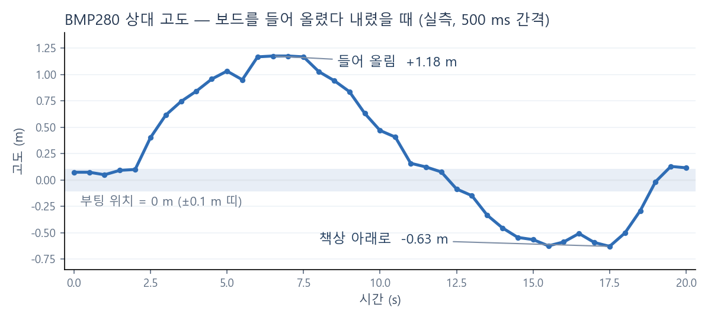

 
위 그래프의 원본 Tera Term 로그 (부팅 → 0점 → 들어 올림 → 내림)

### ④ 온도 — 엄지로 센서 누르기 (BMP280 → UART)

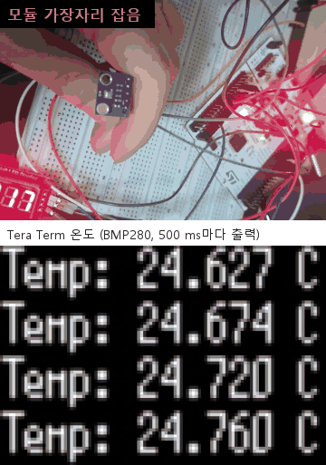 
위: 실제 동작 · 아래: 같은 시점의 Tera Term 온도 (두 녹화를 엄지 누름·뗌 순간에 맞춰 합침) 
약 <code>24.7</code> °C → 엄지 체온으로 최대 <code>30.24</code> °C → 손을 떼면 다시 내려감 
값은 손이 닿은 뒤 서서히 오르고, 뗀 뒤 서서히 내려감: 센서 칩과 모듈 기판이 데워지고 식는 데 걸리는 시간

## 트러블슈팅 하이라이트

**① BMP280 SPI 통신 실패 — 보드 핀 오배선** · CSB는 토글하는데 SCK에 클럭이 없음 → NUCLEO 회로도 추적 → CN10-26/28/30은 F103RB에서 PB15/14/13 → CN10-11/13/15로 이동

| 증상: CSB(초록)만 토글, SCK(노랑) 없음 | 원인: CN10 솔더 브리지 구성 | 해결 후: SPI 데이터 파형 |
|:---:|:---:|:---:|
|  | 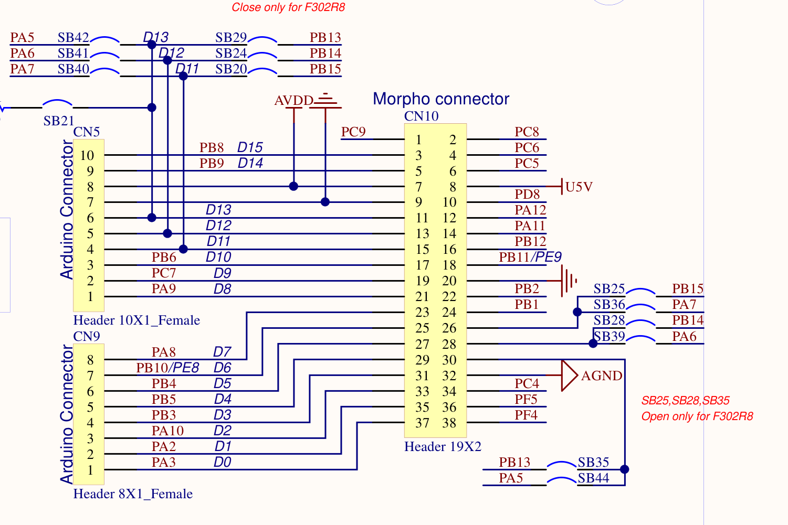 | 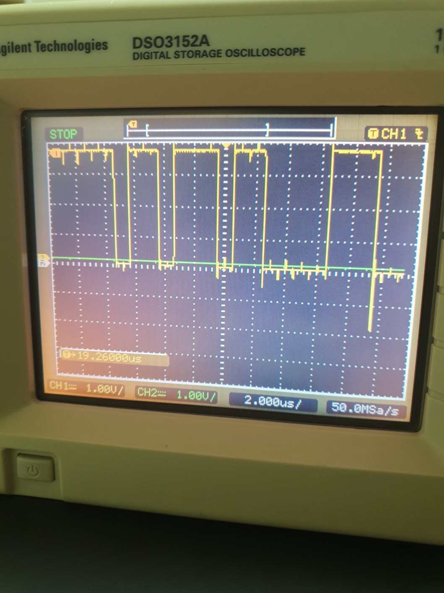 |

**② 책상 위에서 고도 −42.7 m** · 로그 기압을 공식에 직접 넣어 같은 값 재현 → 계산은 정상, 기준 기압이 1013.25 hPa 기본값 → 부팅 시 첫 측정(max 43.2 ms → 50 ms 대기)을 기준으로 0점 설정 → 위 그래프처럼 0 m에서 시작

→ 디버깅 과정, 측정 사진, 리뷰 이슈: [05_troubleshooting.md](docs/05_troubleshooting.md)

## 검증 증거

| 디버거 SFR: USART2 `BRR = 0x116` | 디버거 SFR: SPI1 `CR1 = 0x357` | 디버거 SFR: I2C1 `CCR = 0xA0` · `TRISE = 0x21` |
|:---:|:---:|:---:|
| 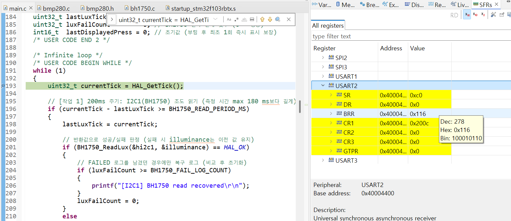 |  | 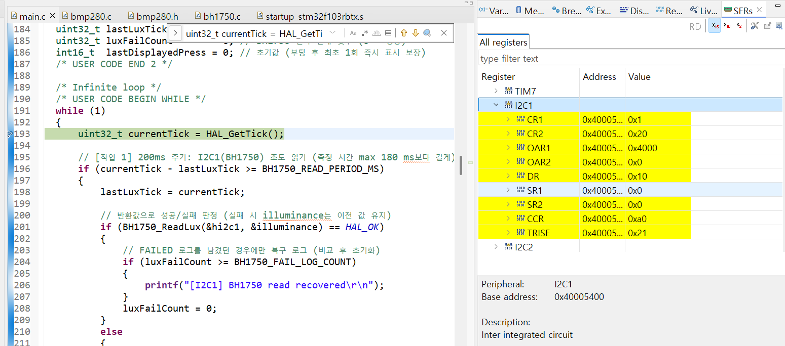 |
| **멀티미터: TM1637 CLK High 4.909 V** | **멀티미터: NUCLEO 5V 4.886 V** | **멀티미터: GY-302 풀업 SCL–SDA 9.387 kΩ** |
|  | 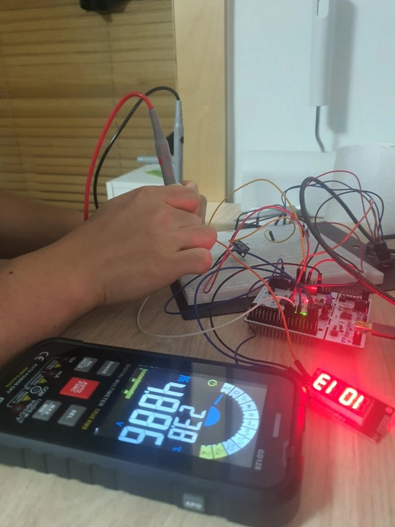 |  |

UART 출력 간격 실측 평균 500.42 ms (타임스탬프 로그 316개 간격) · USART2 `BRR = 0x116` · 레지스터 값은 모두 RM0008 기준 계산값과 일치

→ 검증 매트릭스(R1~R8), 합격 기준, 원본 로그: [06_testing_and_results.md](docs/06_testing_and_results.md)

## 상세 문서

| 문서 | 내용 |
|---|---|
| [01 시스템 아키텍처](docs/01_system_architecture.md) | 개발 목적, 주요 기능, 개발 환경, 부팅·런타임 흐름, 모듈 역할 |
| [02 하드웨어](docs/02_hardware.md) | 용어 풀이, 핀 연결표, 통신 방식별 신호, 3.3 V ↔ 5 V 연결, 풀업 저항 실측 |
| [03 CubeMX 설정](docs/03_cubemx_configuration.md) | 클럭, GPIO, I2C·SPI·UART 설정과 레지스터 계산 |
| [04 펌웨어 구현](docs/04_firmware_implementation.md) | 핵심 구현 5가지, 소스 구성, HAL → 레지스터 → 신호 추적, 실제 로그 |
| [05 트러블슈팅](docs/05_troubleshooting.md) | 실제 디버깅 2건(SPI 오배선, 고도 기준값), 설계 대응, 리뷰 이슈 |
| [06 테스트 결과](docs/06_testing_and_results.md) | 검증 매트릭스, 고장 주입 3건, 레지스터·멀티미터 확인, 리소스 |
